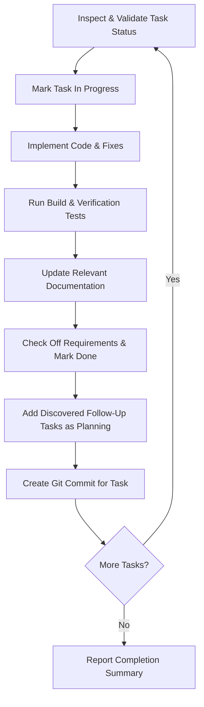

# Execute Tasks Workflow Skill

This skill defines the standardized procedure for executing a specific set of tasks sequentially with strict status validation, documentation updates, follow-up tracking, and per-task commits.

---

## 1. Task Status Validation & Confirmation

Before starting execution on any given task ID, inspect its status using `./scripts/get-task <ID>`:

- **Valid Statuses to Work On**:
  - `pending` (Ready for implementation)
  - `in_progress` (Work currently active)

- **Invalid / Ambiguous Statuses**:
  - `planning`: Scoping incomplete; requirements still unknown.
  - `triage`: Requirements known, but prioritization or technical approach unconfirmed.
  - `research`: Technical investigation required before planning.
  - `done` / `fixed`: Task is already completed.
  - `cancelled`: Task was discarded or rejected.
  - `blocked`: Task is waiting on external dependencies or decisions.

> [!WARNING]
> **Status Check Rule**: If any requested task is in an invalid status (such as `planning`, `triage`, `research`, `done`, `cancelled`, or `blocked`), you **must stop, report the task ID and its current status to the user, explain why it is not ready for implementation, and ask for explicit confirmation** before proceeding with that task.

---

## 2. Step-by-Step Task Execution Loop

Process each validated task **strictly one at a time** in the requested order:



### Step A: Mark In Progress
Transition the task to active work:
```bash
./scripts/update-task <ID> --status in_progress
```

### Step B: Implement Requirements
1. Read the task requirements using `./scripts/get-task <ID>`.
2. Inspect the relevant source files and implement the requested changes adhering to project architecture and best practices.
3. If partial implementation is required or edge cases emerge, record notes directly in the task description.

### Step C: Verify & Test
Run build verification and automated tests to ensure no regressions:
- For iOS: `xcodebuild -scheme MonsterCards -project iOS/MonsterCards.xcodeproj -destination 'platform=iOS Simulator,name=iPhone 17' build` (or test)
- For Android: `./gradlew test` or `./gradlew assembleDebug`

### Step D: Update Documentation
Check if the changes affect:
- [README.md](file:///Users/tom/Projects/MonsterCards/README.md)
- `Project.md` / `Project.json`
- Feature specifications or architecture docs
Update the corresponding documentation files accordingly.

### Step E: Mark Task Done
Check off completed checklist items and transition status to `done`:
```bash
./scripts/update-task <ID> --status done --check-all
```
If specific items remain uncompleted or need notes:
```bash
./scripts/update-task <ID> --status done --append-description "### Implementation Notes:\n- Completed core logic.\n- Follow-up logged in OT-XXX."
```

### Step F: Record Newly Discovered Tasks
If during the work any new bugs, edge cases, refactor opportunities, or follow-ups are discovered, log them immediately in `planning` status:
```bash
./scripts/add-task "Follow-up: <Descriptive Title>" --project=<proj> --type=<type> --status=planning -d "Discovered during work on <ID>:\n- [ ] Detail"
```

### Step G: Create Git Commit
Create a dedicated Git commit for the completed task:
```bash
git add <modified-files>
git commit -m "<type>(<project>): <concise summary of task ID>"
```
*(At least one commit must be made per completed task before moving to the next task).*
