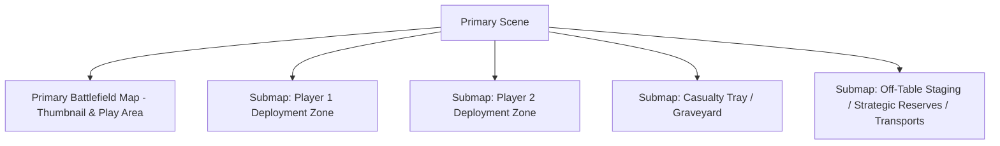
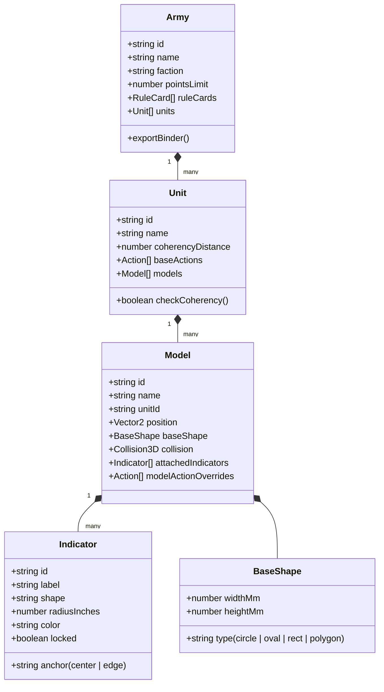
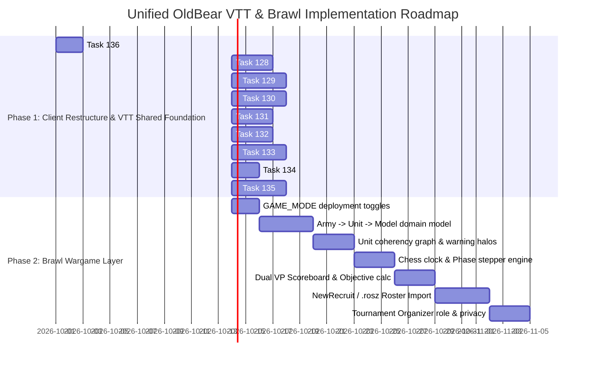

# Old Bear Brawl (Brawl) — System-Agnostic Tabletop Wargame VTT
## Product Architecture, Strategy & Master Specification

---

## 1. Architectural Strategy & Deployment Model

### Unified Application with Deployment Game Modes
Instead of maintaining a disconnected, permanently diverging fork, **Old Bear Rodeo will operate as a single unified codebase supporting selectable Game Modes** via environment configuration:
- `GAME_MODE=vtt`: Traditional TTRPG mode (D&D 5e, Pathfinder 2e, character sheets, spellbooks).
- `GAME_MODE=brawl`: Tabletop wargaming mode (Warhammer 40k, Kill Team, BattleTech, armies, units, chess clocks, VP boards).
- `GAME_MODES=vtt,brawl`: Multi-mode enabled (allows choosing mode per room/session).

#### Hosted vs. Self-Hosted Infrastructure
- **Official Hosted Instances**: Dedicated URLs serving single-mode playground environments (e.g., `vtt.oldbear.app` and `brawl.oldbear.app`) for clean, uncluttered user experiences.
- **Self-Hosters**: Deploying their own Docker container can set `GAME_MODE` to whichever mode they want, or enable both.

#### Implementation Order: Shared VTT Foundation First
To maximize velocity and avoid throwaway work, **all shared features will be implemented directly in the core codebase for VTT first** (tracked in `Tasks.md` as Tasks 128–135). Once these foundations (modular submaps, indicator toolbars, token tethering, pie-wedge clocks, timers, custom status lifecycles, advanced dice engine, and `.binder` import/export) are operational, the Brawl-specific wargame layer (`Army` ➔ `Unit` ➔ `Model`, coherency graphs, chess clocks, and phase steppers) will be cleanly layered on top.

---

## 2. Core Philosophy & System-Agnostic Principles

1. **System Agnostic, No Copyrighted Content Bundled**:
   - Zero hardcoded proprietary rules, stats, or text from Games Workshop or other commercial publishers.
   - Built to handle Warhammer 40k, Age of Sigmar, Horus Heresy, Kill Team, BattleTech, Warcry, Star Wars Legion, or indie wargames.
   - All army data is strictly **User-Generated Content (UGC)** or pulled on-demand from open community sources/APIs when the game system is recognized.
2. **True Base-to-Base Measurement**:
   - Measurements use the closest token edge to closest token edge (perimeter-to-perimeter) rather than center-to-center.
   - Accommodates mixed measurement units: distances in inches (`"`) and base sizes in millimeters (`mm`).
3. **2D Canvas First, 3D-Ready Architecture**:
   - Fast, responsive 2D HTML5 canvas for the initial release.
   - Every token and terrain prop stores 3D collision definitions (base shape, height, volume) to enable future WebGL rendering seamlessly without data migrations.

---

## 3. Submaps: Unified Architecture for Zones & Staging Areas

Rather than building separate bespoke systems for deployment zones, casualty boxes, and transports, Brawl and VTT leverage **Logical Submaps within the Scene**:



### 3.1 Submap Capabilities
- **Hybrid Entities**: Submaps act as a hybrid between maps, props, and bounded zones.
- **Canvas Coexistence**: Positioned in the same canvas coordinate space with independent background color, name label, border styling, dimensions, and grid settings.
- **Applications**:
  - **Deployment Zones**: Shaded, labeled, and color-coded zones matching mission specifications.
  - **Casualty Tray / Graveyard**: Designated staging area off the map where slain models are moved (allowing easy resurrection, apothecary heals, Necron reanimation, or secondary objective scoring).
  - **Off-Table Staging Area**: Strategic reserves, deep strike units, and embarked units inside transports.
  - **Multi-Level Maps (for VTT)**: Multi-floor buildings (Floor 1, Floor 2, Basement) or connected rooms (Tavern + Cavern portal) in a single interactive scene.
- **Scene Templates**: Players can create and save a "Base Tournament Scene" complete with standard deployment zones, casualty trays, and reserve staging boxes, then duplicate the scene and swap just the primary battlefield image.

---

## 4. Persistent Indicators, Auras, Spray Overlays & Tethering

### 4.1 Indicator Bottom Properties Bar
When an indicator (circle, rectangle, cone/arc, arrow, spray) is selected, a context bar opens at the bottom (matching the token/prop editor style):
- **Custom Name / Label**: Name indicators individually (e.g. `"Captain 6\" Aura"`, `"Threat Range"`, `"Heavy Bolter Facing"`).
- **Multi-Aura Support**: A single token can host multiple active indicators simultaneously (e.g. two distinct aura radii and a directional facing cone, each with unique labels and colors).
- **Dimensions & Spread**: Quick inputs for radius, width, and arc spread angle (`60°`, `90°`, `120°`, `180°`).
- **Rotation Control**: Rotation input box and visual compass rotation widget (reusing the prop rotation tool).
- **Anchor Mode**: `Center` vs `Base Edge` (essential for wargames measuring auras from the model's base perimeter).
- **Auto-Duplication**: Copying or duplicating a token automatically duplicates all attached indicators.
- **Lock / Unlock `🔒`**: Prevents accidental dragging during play.
- **3D Volume Option**: Toggle between `Cylinder` (default, with height input) and `Sphere`.

### 4.2 Spray Indicator Tool
- Custom image overlay deployed via click-center and drag-radius (with live distance preview).
- Useful for custom objective markers, spell effects, hazard zones, or terrain decals.
- Fully selectable, movable, rotatable, and resizable after placement when `📌 Persist` is enabled.

### 4.3 Token-to-Token & Token-to-Prop Tethering
- Dynamic connecting lines drawn between two tokens or a token and a prop.
- **Styles**: `Straight` or `Wiggly` (sine wave).
- **Parameters**: Line color, stroke width, and sine wave frequency/amplitude.
- Automatically tracks both endpoints as entities move (useful for unit coherency links, psychic links, tow cables, or spell tethers).

### 4.4 Objective & POI Markers
- Treated as persistent markers or props with attached circle indicators.
- **Control Zone Calculation**:
  - Automatically or on-demand checks if a player controls a token overlapping or completely within the marker.
  - Can be evaluated at turn start, turn end, or during a specific scoring phase.
  - Generates an audit message in chat and triggers an animated toast.
  - Optional point value and toggle checkbox in settings to enable auto-calculation (keeps games clean that do not use automated scoring).

---

## 5. Domain Model & Hierarchy



### 5.1 Auto-Naming & Disambiguation
- **Model Auto-Naming**: If an explicit model name is not entered, it defaults to `<Unit Name> <Number>` starting from 1 (e.g., `Terminators 1`, `Terminators 2`).
- **Duplicate Unit Disambiguation**: When multiple units share the same name, units are automatically numbered/lettered to avoid confusion: `Terminators A 1`, `Terminators B 1`.

### 5.2 Unit Coherency Engine
- Configurable distance rule (e.g. 2″ horizontal, 5″ vertical).
- Graph connectivity check:
  - Units of 2–5 models: Every model must be within distance of at least 1 other model in the unit.
  - Units of 6+ models: Every model must be within distance of at least 2 other models in the unit.
- Visual warning: Pulsing halo on breaking models + optional tether line indicators.

---

## 6. Action-Tied Dice Engine & Roll Expressions

Custom dice rolls are tied directly to action buttons on models, units, and tokens, as well as executable via `/roll`:

### 6.1 Expression Syntax
- **Standard Flat Roll**: `/roll 40d6+3`  
  *Rolls 40 dice, displays raw values, adds 3 to the total.*
- **Grouped Modified Roll**: `/roll 40(d6+3)`  
  *Rolls 40 individual d6s, applies +3 to every single die, displays all 40 values, and calculates grand total (`sum(raw rolls) + 3*40`).*
- **Threshold Success / Failure Counting**: `/roll 10(d6+2 >= 5)` or `/roll 10(d6+2)/5`  
  *Evaluates the boolean condition per die and reports total successes and failures.*
- **Botch / Glitch Support (Shadowrun / Vampire)**:  
  *Flags 1s as botches/glitches and outputs net successes, total successes, and glitch warnings.*

---

## 7. Statuses with Counters & Turn Lifecycles

Token statuses support system-agnostic condition tracking with automatic counter increments and round triggers:

```json
{
  "label": "Dying",
  "description": "The unit is dying",
  "color": "red",
  "counter": {
    "start": 1,
    "update": 1,
    "max": 3
  },
  "showOnToken": true,
  "clearWhen": "beginning_of_turn",
  "updates": "end_of_turn"
}
```

### Storage Hierarchy
1. **Global / Account Defaults**: Stored in `localStorage` for now.
2. **Per-Scene Overrides**: Stored with the scene data, overriding or supplementing defaults.
3. **Turn Transitions**: Advances counters or removes statuses automatically on `beginning_of_turn` or `end_of_turn`.

---

## 8. Clocks & Timers

1. **Timers**:
   - Chat command `/timer <duration>` supporting minutes/seconds and decimals:  
     `/timer 10 min`, `/timer 30s`, `/timer 2.5m`.
   - Floating / docked HUD display with start, pause, reset, and audible alerts.
2. **Blades in the Dark Segmented Progress Clocks**:
   - Circular clock divided into an arbitrary number of pie wedges (defaulting to 8 slices).
   - Placeable on the canvas or tracked in a floating window.
   - Click `+` to light up the next clockwise wedge; click `-` to dim a wedge.
3. **Chess Clocks (Brawl Mode)**:
   - Per-player countdown clocks with turn limits and active player switching.

---

## 9. Scoreboard & Victory Points

- **Multi-Metric Tracker**: Primary VP, Secondary VP, Command Points (CP), and Casualties.
- **Audit Trail**: Every increment/decrement logs a system message in chat and triggers an animated toast.
- **Action Triggers**: Unit/Model actions can directly alter resource pools (e.g. using a Stratagem automatically deducts 1 CP and toasts the action).

---

## 10. Army Ingestion, Roster Imports & The `.binder` Specification

### 10.1 Legal & Copyright Protection
- The application contains **zero proprietary or copyrighted text/art** from game publishers.
- All imported data is User-Generated Content (UGC) or fetched from public community APIs when recognized.

### 10.2 Universal `.binder` (`application/json`) Interchange Format
A common JSON interchange schema for sharing assets across tools:
```json
{
  "version": "1.0",
  "entities": {
    "characters": [],
    "tokens": [],
    "props": [],
    "maps": [],
    "scenes": [],
    "statuses": []
  },
  "vtt": {},
  "brawl": {
    "armies": []
  }
}
```

### 10.3 Roster Ingestion Pipeline
- Supports popular 40k roster exports (e.g. **NewRecruit JSON** and **BattleScribe `.rosz`**).
- Imports with or without token art / 3D models.
- Allows players to select a default base graphic / 3D model for their entire army or customize individual models.
- Armies are stored as editable assets in the Asset Manager.

---

## 11. Implementation Roadmap


