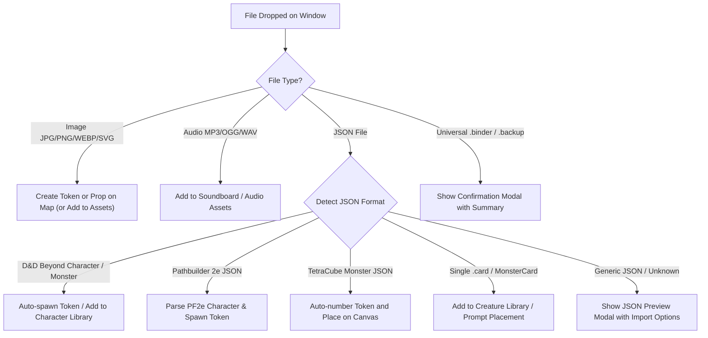

# System-Agnostic Import & Reference System Architecture

**Document:** `docs/system-agnostic-import.md`  
**Related Tasks:** OB-140, OB-141, OB-142, OB-143, OB-153, OB-177, OB-179  
**Status:** Design Proposal & Roadmap

---

## 1. Executive Summary & Vision

OldBear VTT aims to provide lightweight, frictionless tabletop play across D&D 5e, Pathfinder 2e / Starfinder 2e, and homebrew systems without getting bogged down in rigid rules enforcement engines.

Players and Game Masters need to:

1. **Drop anything into the VTT** (character sheets, monster statblocks, `.binder` packs, maps, audio, or tokens) and have OldBear intelligently route, preview, or import it.
2. **Quickly reference public game data** (spells, items, weapons, feats, traits, monster statblocks) on the fly via chat commands.
3. **Inspect before rolling**: Use a clean, memorable `?` syntax (e.g., `/spell? magic-missile`, `/item? healing-potion`, `/monster? goblin`) to preview rich statblocks in chat or local tooltips without triggering an action or roll.
4. **Import from authoritative open sources** using one primary source for D&D 5e (Open5e / SRD 5.1) and one primary source for Pathfinder 2e (Foundry VTT PF2e Packs / Pathbuilder / AoNPRD), while allowing direct URL ingestion.

---

## 2. Core Entity & Action Data Model

Rather than maintaining separate schemas for every game system, OldBear unifies character, NPC, monster, and prop actions into a streamlined **System-Agnostic Entity Model**.

### 2.1 Unified Action Model (`EntityAction`)

Attacks, spells, equipment items, traits, and class features all share a common `EntityAction` structure:

```typescript
export type ActionType =
  | 'attack'
  | 'spell'
  | 'item'
  | 'ability'
  | 'trait'
  | 'feat';

export type ActionCostType =
  // D&D 5e / Generic
  | 'action'
  | 'bonus_action'
  | 'reaction'
  | 'free'
  | 'minute'
  | 'hour'
  // PF2e / SF2e Action Economy
  | '1_action' // [◆] or [1A]
  | '2_actions' // [◆◆] or [2A]
  | '3_actions' // [◆◆◆] or [3A]
  | 'reaction_pf2e' // [↺] or [R]
  | 'free_pf2e'; // [◇] or [FA]

export interface EntityAction {
  id: string;
  name: string;
  type: ActionType;
  description: string;
  cost?: ActionCostType; // Display glyph / badge
  traits?: string[]; // e.g. ["Evocation", "Force", "Agile", "Finesse", "Concentration"]
  range?: string; // e.g. "120 ft.", "Touch", "Self"
  target?: string; // e.g. "1 creature", "20-foot radius sphere"
  duration?: string; // e.g. "Instantaneous", "1 minute"
  savingThrow?: {
    ability: 'str' | 'dex' | 'con' | 'int' | 'wis' | 'cha';
    dc?: number;
  };
  rollFormula?: string; // e.g. "1d20+5" or "3d4+3"
  damageFormula?: string; // e.g. "1d8+3"
  damageType?: string; // e.g. "slashing", "fire", "force"
  sourceUrl?: string; // Origin reference link
  sourceSystem?: '5e' | 'pf2e' | 'generic';
}
```

### 2.2 Visual Action Cost Glyphs & Traits

We do not implement a complex rule validation engine that prevents users from acting if they run out of points. Instead, we render recognizable visual badges:

- **D&D 5e**: `[Action]`, `[Bonus Action]`, `[Reaction]`, `[Free]`
- **PF2e**: Standard Unicode/SVG action glyphs:
  - `◆` (1 Action)
  - `◆◆` (2 Actions)
  - `◆◆◆` (3 Actions)
  - `↺` (Reaction)
  - `◇` (Free Action)
- **Trait Pills**: Rendered as subtle colored tags (e.g., `Agile`, `Finesse`, `Evocation`, `Rare`, `Magical`).

---

## 3. Reference Data Sources

To avoid maintenance headaches and fragile HTML scraping, we standardize on **one structured open source per major system**:

### 3.1 D&D 5e Reference Source: Open5e REST API / GitHub

- **Primary Source**: `https://api.open5e.com/v1/` and `https://github.com/open5e-api/open5e-api`
- **Why**:
  - Fully licensed under OGL / Creative Commons (CC-BY-4.0).
  - Clean, stable REST endpoints returning structured JSON for:
    - `/spells/?search=magic+missile`
    - `/monsters/?search=goblin`
    - `/magicitems/?search=bag+of+holding`
    - `/weapons/`, `/armor/`, `/feats/`
  - Zero scraping needed, no Cloudflare blocks, and high reliability.
  - Can be cached in client-side IndexedDB for offline play.

### 3.2 Pathfinder 2e Reference Source: Foundry VTT PF2e Compendium Packs

- **Primary Source**: `https://github.com/foundryvtt/pf2e/tree/v14-dev/packs`
- **Why**:
  - The gold standard of public PF2e data, officially licensed under Paizo's Open RPG Creative (ORC) license and Open Game License (OGL).
  - Raw JSON files partitioned by directory:
    - `spells/`
    - `equipment/`
    - `feats/`
    - `bestiary/`
    - `actions/`
  - Already contains exact action costs (`1`, `2`, `3`, `reaction`, `free`), full traits arrays, level, rarity, and markdown descriptions.
  - Direct raw GitHub raw content URLs (`https://raw.githubusercontent.com/foundryvtt/pf2e/v14-dev/packs/...`) allow targeted instant fetching without cloning entire large repositories.

### 3.3 Custom URL & Direct ID Ingestion

When a user provides a specific URL:

1. **Pathbuilder 2e URL**: `https://pathbuilder2e.com/json.php?id=<build_id>` (already supported via OB-144).
2. **D&D Beyond URL**: Direct monster/character IDs or public character JSON URLs (`https://character-service.dndbeyond.com/character/v5/character/<id>`).
3. **Foundry / GitHub raw JSON URLs**: Directly parse JSON containing `system`, `type`, `name`, `description`.
4. **Generic Webpages**: Fail with a message that the page type is unsupported.

---

## 4. Chat Commands & The `?` Inspection Paradigm

### 4.1 Roll vs. Inspect (`?`) Syntax

Users often want to read what an ability or spell does before casting it. We use the trailing question mark (`?`) convention:

| Standard (Use / Roll)   | Inspection (`?`) (Statblock Card) | Action Taken                                                                   |
| :---------------------- | :-------------------------------- | :----------------------------------------------------------------------------- |
| `/spell magic-missile`  | `/spell? magic-missile`           | Displays the full spell card in chat (school, cost, range, traits, full text). |
| `/attack longsword`     | `/attack? longsword`              | Displays weapon stats, damage formula, weapon properties (`Versatile (1d10)`). |
| `/item healing-potion`  | `/item? healing-potion`           | Displays item description, rarity, weight, and consumable rules.               |
| `/ability sneak-attack` | `/ability? sneak-attack`          | Displays feature explanation, conditions, and scaling table.                   |
| —                       | `/monster? goblin`                | Displays full monster statblock card in chat or local flyout.                  |

### 4.2 `/import` Chat Command Syntax

Users or GMs can import reference material directly from the chat box:

```text
/import <url>
/import spell "https://api.open5e.com/v1/spells/magic-missile/"
/import item "https://raw.githubusercontent.com/foundryvtt/pf2e/v14-dev/packs/equipment/healing-potion-lesser.json"
/import monster "https://www.dndbeyond.com/monsters/16939-kobold"
```

- **Type Inference**: If the command omits the category (`/import <url>`), OldBear checks URL keywords (`/spells/`, `/equipment/`, `/monsters/`, `pathbuilder`) to infer the entity type.
- **Workflow Option**:
  - Chat card displays: **`[+ Add to Character]`** and **`[Spawn Token]`** buttons.
  - Clicking `[+ Add to Character]` attaches the action to the currently selected token or active character sheet.
  - Not clicking keeps it purely as a chat reference card without cluttering any sheet.

---

## 5. Universal Drag-and-Drop Ingestion (OB-140 Rescoped)

The canvas and application window will support dropping any valid VTT file directly onto the screen.



### 5.1 Large / Complex File Confirmation Modal

When importing a file containing multiple items or significant data:

- **Trigger**: Files larger than 250 KB, `.binder` packages, backup archives, or multi-character JSONs.
- **Modal Display**:
  - Title: _"Import Confirmation"_
  - Summary: `"Universal .binder package (1.2 MB)"`
  - Contents Breakdown:
    - `37 NPC / Monster Cards`
    - `2 Player Characters`
    - `12 Map Assets`
    - `4 Audio Tracks`
  - Action Buttons: `[Cancel]` and `[Import All (48 items)]`.

---

## 6. Phased Implementation Roadmap

To avoid taking on too much at once, tasks are structured into sequential, self-contained phases:

### Phase 1: Core Chat Ergonomics & Rescoped Drag-and-Drop

1. **OB-179**: Up/Down arrow history in chat input box (cycle previous commands/messages to fix typos).
2. **OB-140**: Universal file drag-and-drop listener with auto-routing and confirmation modal for large bundles.

### Phase 2: Inspection Cards & Command Foundation

3. **OB-180** (New): System-Agnostic `EntityAction` schema and `StatBlockCard` chat renderer with action cost glyphs (`◆`, `◆◆`, `1A`, `BA`, `R`) and trait tags.
4. **OB-181** (New): Implement the inspection query syntax (`/spell?`, `/item?`, `/attack?`, `/ability?`, `/monster?`).

### Phase 3: Primary External Reference Sources

5. **OB-141 & OB-142**: Implement Open5e reference fetcher for D&D 5e spells, items, and monsters (`/import` and `/spell?`, `/item?`).
6. **OB-177 & OB-153**: Implement GitHub raw pack fetcher for Foundry PF2e spells, equipment, and actions with 3-action economy glyphs.

### Phase 4: Token Creation & Sheet Integration

7. **OB-143**: `[Spawn Token]` and `[+ Add to Character]` one-click buttons on imported reference cards.

---

## 7. Next Steps for Next Session

When starting the next session:

1. Read this document (`docs/system-agnostic-import.md`) to load full context.
2. Review the updated task list in `Tasks.md`.
3. Begin with **OB-179** (Chat history cycle) and **OB-140** (Universal drag-and-drop with confirmation modal).
